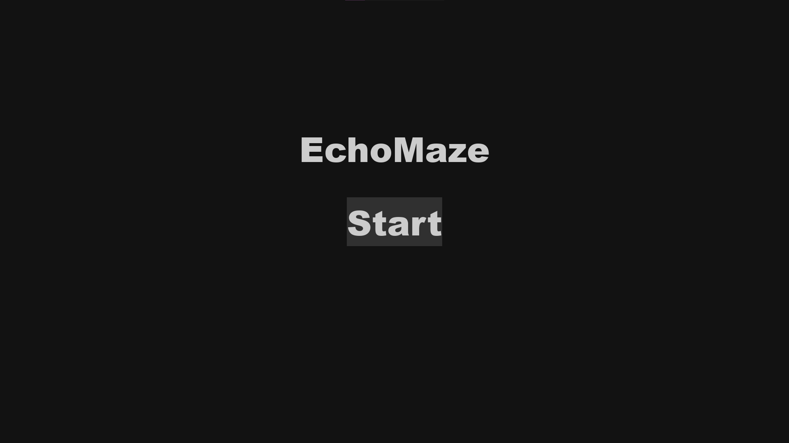
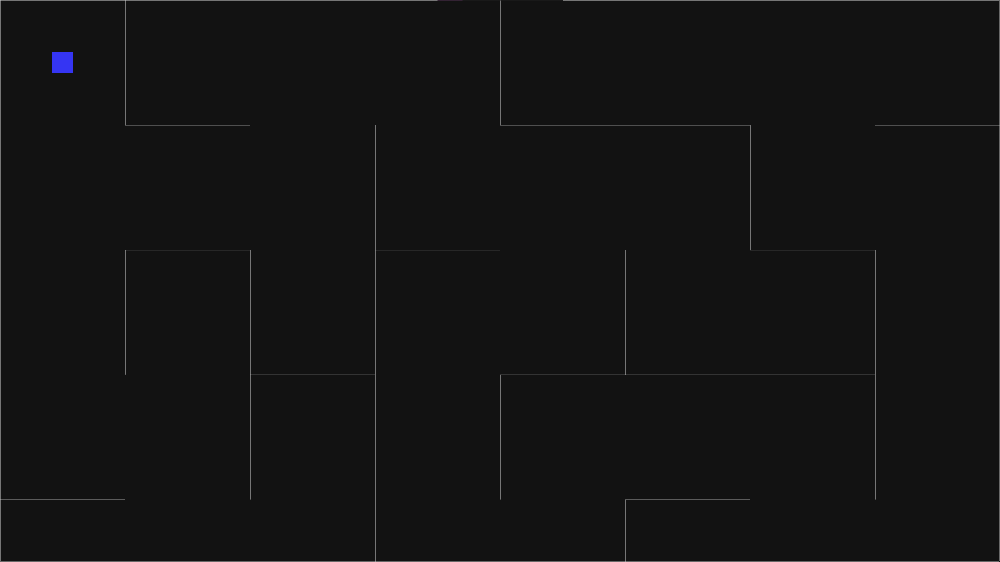

# EchoMaze - игра-головоломка на pygame.

1. Информация о проекте
    1. Название: EchoMaze, назначение: практика использования библиотеки pygame
    2. Количество строк кода: 600
    3. [Техническое задание](materials/technical_specification.md)
   > - Игра разрабатывается на базе курса Лицей Академии Яндекса.
   >- Разработка идёт до 3-го февраля 2025-го года.
2. Установка библиотек
   > - Минимальная версия python: 3.11;
   > - Для установки нужных библиотек в терминале, находясь в корневой папке проекта, пропишите "pip install
       requirements.txt".
3. Поддержка проекта
   > Для добавления нового лабиринта в игру нужно:
   > - Создать новый файл с разрешением ".py" со структурой подобной файлу [walls.py](levels/walls.py);
   > - Выбрать расстояние сетки: переменная w;
   > - Последовательно создавать экземпляры класса Wall.
4. Описание работы
   > - Игра - невидимый лабиринт, где главный герой с помощью специальной способности может выпускать звук, чтобы стенки
       стали видимы.
   >- Из-за главного элемента геймплея - невидимости стен, игра становится сложной.
   >- Меню
      
   >- Пример лабиринта
      
5. Скринкаст работы
   > [Скринкаст](https://youtube.com).