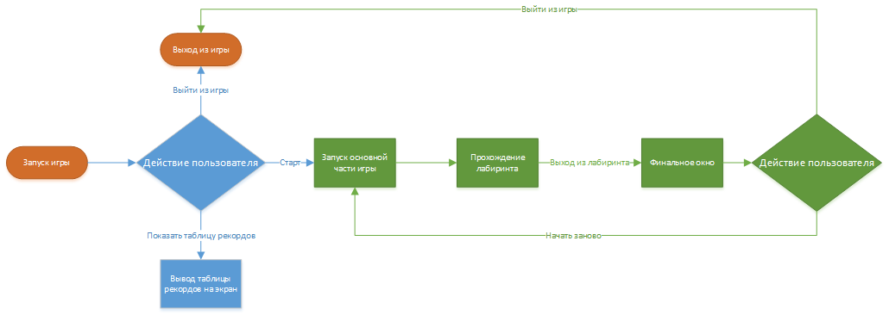

# Техническое задание

1. Project Name: Лабиринт с эхолокацией
2. Authors:
    - Team Lead: Чагаев Егор Алексеевич.
    - Project Developers: Чагаев Егор Алексеевич (пока я один)
    - Teacher: Анатольев Алексей Владимирович
3. Description of the program.
    - Запуск и главное меню
   > - Запуск игры производится через файл main.py или main.exe;
   > - Главное меню включает в себя кнопки: старт, настройки, выход из игры, а также текст с названием самой игры.
    - Завершение игры и финальное окно
   > - При выходе из лабиринта появляется окно, гже пользователю будет предложено пройти лабиринт ещё раз;
   > - В финальном окне можно будет увидеть насколько быстро игрок прошёл лабиринт.
    - Управление персонажем и объекты
   > - Камера находится сверху, так что персонаж может двигаться вперёд, назад, влево и вправо;
   > - Изначально стенки лабиринта не видно, но чтобы их отобразить надо "издать звук";
   > - Нажав на отдельную кнопку персонаж может "издать звук" - выпустить некое количество объектов, которые при
       попадании в стенку прилепляются к ней;
   > - Таким образом можно будет увидеть стенки лабиринта.
    - Взаимодействие объектов и персонажа
   > - Персонаж обладает коллизией, т. е. не может проходить сквозь стены;
   > - "звук" может прилипнуть к стене;
   > - "звук" и персонаж могут проходить сквозь друг-друга.
    - Музыка и звуки
   > - Во время прохождения лабиринта будут играть несколько спокойных произведений;
   > - При "издании звука" будет воспроизводиться тихий звук, как у радаров подводной лодки;
   > - При прохождении лабиринта будет проигрываться радостная мелодия.
4. Project Description.
   - Структура проекта:
   > - Готовый проект запускается из файла "main.py" или "main.exe";
   > - Импортируем все нужные нам классы и функции из /data/;
   > - Схема работы 
5. Program code plan.
    - Функции:
   > main(), start_game();
    - Классы:
   > Character, Sound; Wall; 
    - Библиотеки:
   > pygame.
6. Graphical interface.
   - будет потом
7. Deadlines.
   | Задача | Дедлайн |
   | ------------- | ------------- |
   | Создание команд, описание проекта | 8 декабря 23:59 |
   | Задание ТЗ (technical_specification.md) | 15 декабря 23:59 |
   | Часть задания сделана | 22 декабря 23:59 |
   | Работающая часть проекта | 29 декабря 23:59 |
   | Черновик пояснительной записки (README.md) | 19 января 23:59 |
   | Презентация | 26 января 23:59 |
   | Всё готово к вечеру перед защитой | 2 февраля 23:59 |
   | Защита | 3 февраля |
